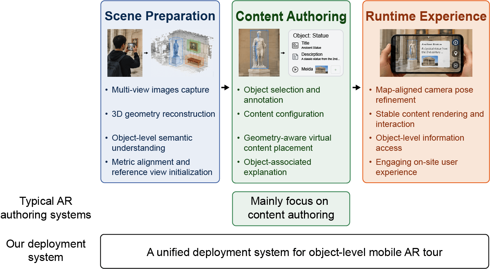

# Feed-Forward Visual Geometry Model Meets AR: An On-the-fly Mobile AR Tour Deployment Framework with 3D Semantic Mapping and Camera Pose Refinement (Under review)

**Authors:** Tianchi Luan, [Yuze Wang](https://yuzewang1998.github.io/), Junyi Wang, Minghuan Liu, Chen Wang, Yue Qi

IGGT-based FastAPI backend for on-the-fly mobile AR tour deployment with metric 3D semantic mapping, persistent object instances, confidence-aware reference views, and runtime camera-pose refinement.


## Architecture

The deployment pipeline is:

1. Extract mobile RGB keyframes and optional AR poses.
2. Run IGGT for dense depth, camera parameters, geometric confidence, world points, and instance features.
3. When AR poses are supplied, recover metric scale with confidence-weighted Sim(3). Without AR poses, retain model coordinates and mark the scene non-metric.
4. Run LSeg to associate language-aligned features with IGGT object instances.
5. Fuse a metric/model mesh, semantic mesh, object catalog, and reference-view pool.

Runtime queries run IGGT on the current image and retrieved reference views. Accepted corrections update the persistent map-to-AR root transform atomically with reference-view maintenance. Mobile clients should upload a query approximately every 10 seconds.

## Repository layout

```text
app/                         FastAPI application and reconstruction services
web_demo/                    Flask proxy and static frontend
submodules/                  IGGT and LSeg source snapshots
tests/                       Service and API tests
main.py                      Uvicorn import target
pyproject.toml               Python package metadata and dependencies
```

Model checkpoints are not included. Clone/update the IGGT and LSeg source snapshots and provide local checkpoints separately.

## Requirements

- Linux recommended.
- Python 3.10 or newer.
- `uv` for environment and dependency management.
- CUDA-capable PyTorch installation and sufficient GPU memory.
- Local IGGT and LSeg checkpoints.

Install dependencies:

```bash
uv sync
```

Native and GPU packages may require platform-specific system libraries and a compatible CUDA runtime.

## Configuration

| Variable | Purpose | Default |
| --- | --- | --- |
| `IGGT_CKPT_PATH` | IGGT checkpoint file | `/mnt/data/tcluan/Ckpt/iggt/IGGT_official.pth` |
| `IGGT_DEVICE` | IGGT device | `cuda:0` |
| `IGGT_IMAGE_SIZE` | IGGT resize as `WIDTHxHEIGHT` | `392x630` |
| `LSEG_CKPT_PATH` | LSeg checkpoint file | `/mnt/data/tcluan/Ckpt/lseg/demo_e200.ckpt` |
| `LSEG_DEVICE` | LSeg device | `cuda:0` |
| `RECONSTRUCT_BASE_DIR` | Persistent task directory | machine-specific |
| `FRAME_EXTRACT_FPS` | Fallback extraction rate without AR timestamps | `1.0` |
| `IGGT_MAX_REFERENCE_VIEWS` | Active reference capacity | `50` |
| `IGGT_REFERENCE_RETRIEVAL_COUNT` | References per runtime query | `10` |
| `IGGT_RELOCALIZATION_MIN_CONFIDENCE` | Minimum accepted query confidence | `0.5` |
| `IGGT_REFERENCE_RELIABILITY_WEIGHT` | Reference reliability reward weight | `0.5` |
| `IGGT_REFERENCE_NOVELTY_WEIGHT` | Reference novelty reward weight | `0.5` |
| `IGGT_REFERENCE_MIN_CONNECTIONS` | Minimum connected references | `2` |
| `IGGT_REFERENCE_CONNECTION_THRESHOLD` | Co-visibility threshold | `0.2` |
| `IGGT_REFERENCE_REWARD_MARGIN` | Replacement reward margin | `0.05` |
| `IGGT_DEPLOYMENT_MAX_ALIGNMENT_RMS` | Deployment alignment RMS in meters | `0.05` |
| `IGGT_RUNTIME_MAX_ALIGNMENT_RMS` | Runtime alignment RMS in meters | `0.05` |
| `IGGT_RELOCALIZATION_INTERVAL_SECONDS` | Recommended client upload interval | `10.0` |
| `IGGT_LSEG_ASSOCIATION_MAX_DISTANCE` | IGGT/LSeg association radius in meters | `0.05` |
| `IGGT_MESH_ASSOCIATION_MAX_DISTANCE` | Point/mesh association radius in meters | `0.05` |
| `IGGT_MIN_INSTANCE_POINTS` | Minimum object points | `50` |
| `IGGT_MIN_LSEG_ASSOCIATIONS` | Minimum language associations | `10` |
| `IGGT_INSTANCE_CLUSTER_EPS` | Instance clustering radius in meters | `0.05` |
| `IGGT_INSTANCE_CLUSTER_MIN_SAMPLES` | Instance clustering minimum samples | `10` |
| `IGGT_SEMANTIC_QUERY_MIN_SIMILARITY` | Minimum text/object similarity | `0.25` |
| `IGGT_PRELOAD_ON_STARTUP` | Preload IGGT | `1` |
| `LSEG_PRELOAD_ON_STARTUP` | Preload LSeg | `1` |

Preloading may be disabled for API inspection, but actual reconstruction requires both IGGT and LSeg. Missing or incompatible checkpoints make the task fail; there is no empty-semantic fallback.

AR poses and camera intrinsics are optional. Supplying them enables metric alignment and physical AR root alignment. Without them, the result is explicitly model-scale and runtime root refinement is unavailable.

## Run the FastAPI backend

```bash
uv run uvicorn app.main:app --host 0.0.0.0 --port 6701
```

The API is mounted under `/api/v1`.

### Submit reconstruction

`POST /api/v1/reconstruct` accepts multipart form data:

- `video_file` — required video upload;
- `ar_pose_file` — optional CSV with `timestamp,px,py,pz,qx,qy,qz,qw`;
- `camera_intrinsics_file` — optional JSON matrix or per-frame matrices;
- `video_start_timestamp` — required integer.

Successful tasks publish `mesh.glb`, `semantic_mesh.glb`, `objects.json`, `object_content.json`, `transforms.json`, `intrinsics.npz`, and `point_cloud.ply`.

### Runtime pose refinement

`POST /api/v1/task/{task_id}/relocalize` accepts `image_file` and optionally the JSON form fields `ar_pose`, `intrinsics`, and `timestamp`. `ar_pose` is position plus XYZW quaternion. With `ar_pose`, accepted results return and persist `map_to_ar`; image-only calls return map-frame pose without changing the root transform or reference pool.

### Object services

- `GET /api/v1/task/{task_id}/objects`
- `GET /api/v1/task/{task_id}/objects/{object_id}`
- `PUT /api/v1/task/{task_id}/objects/{object_id}/content`
- `POST /api/v1/task/{task_id}/voice-input`

Content updates are full replacements and are stored separately from generated geometry. Relative task assets and HTTPS URLs are accepted as virtual-content references; the backend does not download external assets.

## Run the web demo

Start FastAPI on port `6701`, then run:

```bash
uv run python -m web_demo.server --host 0.0.0.0 --port 5000
```

The demo accepts ZIP archives containing images and an optional `ar_pose.csv`, converts images to video, and forwards the deployment request. Set `ICXR_BACKEND_URL` when the backend is elsewhere.

## Tests

```bash
uv run pytest tests
```

Model-dependent tests require local checkpoints/GPU; focused geometry/API tests do not.

## Upstream model projects

- [IGGT official implementation](https://github.com/lifuguan/IGGT_official)
- [lang-seg / LSeg](https://github.com/isl-org/lang-seg)

Check upstream licenses and checkpoint terms.

## License

Project code is MIT licensed. Vendored model code remains subject to its upstream license terms.
